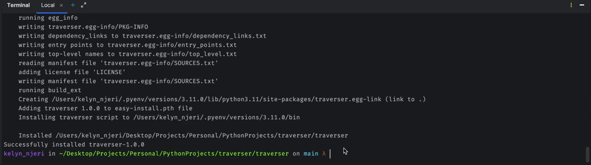

# Traverser
Traverser is a Python package that provides a set of tree algorithms to efficiently search for a specific value within a file. It offers a flexible and intuitive interface to navigate and search through hierarchical data structures, enabling you to easily locate and extract the desired information.

## Built With

- Python

## Live Demo

## Getting Started
To get a local copy up and running follow these simple example steps.

### Prerequisites
- Git
- Python 

### Setup
To have the project up and running on your machine, follow the following:
- [ ] Clone the repo using `git clone https://github.com/TheAlchemistKE/traverser.git`
- [ ] Open the cloned project.
- [ ] Install the package locally using: `pip install -v -e .

### Usage

## Author

👤 **Kelyn Paul Njeri**

- Github: [@KelynPNjeri](https://github.com/KelynPNjeri)
- Twitter: [@KelynNjeri](https://twitter.com/kelyn-njeri)
- Linkedin: [Kelyn Paul](https://linkedin.com/kelyn-paul)

## 🤝 Contributing

Contributions, issues and feature requests are welcome!

Feel free to check the [issues page](issues/).

## Show your support

Give a ⭐️ if you like this project!

## Acknowledgments

- Hat tip to anyone whose code was used
- Inspiration
- etc

## 📝 License

This project is [MIT](lic.url) licensed.
